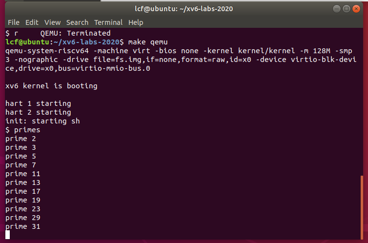
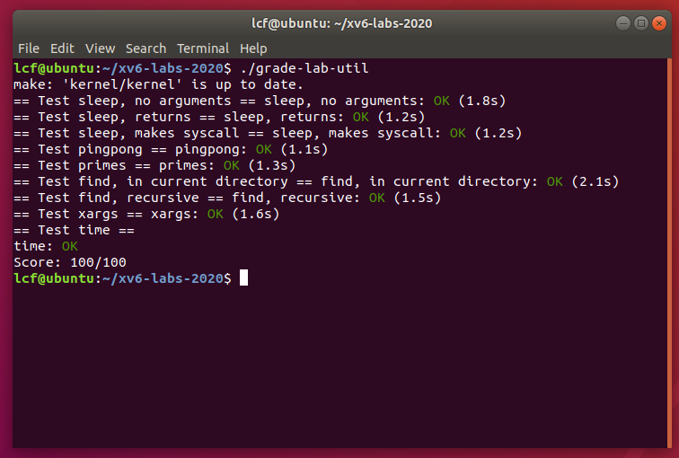

## lab1
### sleep
写一个简单的sleep命令，使用系统调用sleep即可  
需要注意将可执行文件名_sleep添加到makefile中的UPROGS项中
```c
#include "kernel/types.h"
#include "user/user.h"

int main(int argc, char const *argv[])
{
  if (argc != 2) { //参数错误
    fprintf(2, "usage: sleep <time>\n");
    exit(1);
  }
  sleep(atoi(argv[1]));
  exit(0);
}
```

补充，头文件解释，后面的程序中也会用到
kernel/types.h中定义了可能用到的数据类型，主要是无符号型
```c
typedef unsigned int   uint;
typedef unsigned short ushort;
typedef unsigned char  uchar;

typedef unsigned char uint8;
typedef unsigned short uint16;
typedef unsigned int  uint32;
typedef unsigned long uint64;

typedef uint64 pde_t;
```
user/user.h定义了系统响应和包括printf,strcpy等在内的自定义函数
```c
struct stat;
struct rtcdate;

// system calls
int fork(void);
int exit(int) __attribute__((noreturn));
int wait(int*);
int pipe(int*);
int write(int, const void*, int);
int read(int, void*, int);
int close(int);
int kill(int);
int exec(char*, char**);
int open(const char*, int);
int mknod(const char*, short, short);
int unlink(const char*);
int fstat(int fd, struct stat*);
int link(const char*, const char*);
int mkdir(const char*);
int chdir(const char*);
int dup(int);
int getpid(void);
char* sbrk(int);
int sleep(int);
int uptime(void);

// ulib.c
int stat(const char*, struct stat*);
char* strcpy(char*, const char*);
void *memmove(void*, const void*, int);
char* strchr(const char*, char c);
int strcmp(const char*, const char*);
void fprintf(int, const char*, ...);
void printf(const char*, ...);
char* gets(char*, int max);
uint strlen(const char*);
void* memset(void*, int, uint);
void* malloc(uint);
void free(void*);
int atoi(const char*);
int memcmp(const void *, const void *, uint);
void *memcpy(void *, const void *, uint);
```

### pingpong
pingpong利用管道在父进程和子进程之间通信  
- fork()为子进程也复制了一份管道的描述符p[2]
- 两个进程是并行的，因此输出可能会交替（因为最开始主进程没有等待子进程输出，输出混乱所以没通过测试）
- 关于fork和pipe的形象化描述可参考 https://blog.csdn.net/qq_43471489/article/details/125434743
```c
#include "kernel/types.h"
#include "kernel/stat.h"
#include "user/user.h"

int main(int argc, char *argv[]){
  int p[2];
  pipe(p);
  if(fork()==0){
    char buf[128];
    read(p[0],buf,12);
    printf("%d: received ping\n",getpid());
    write(p[1],"Hello too\n",9);
    close(p[0]);
    exit(0);
  }
  else{
    char buf[128];
    write(p[1], "Hello World\n", 12);
    read(p[0],buf,9);
    printf("%d: received pong\n", getpid());
    close(p[1]);
    exit(0);
  }
}
```

### primes
这个程序的任务描述最开始没看懂，其实就是对管道的运用训练，具体可描述为  
1. main创建一个管道，并将2~35输入管道
2. primes函数生成一个子进程，并再次生成一个管道（1.中的管道称为左邻居，2.中生成的新管道称为右邻居）
3. 从左邻居中读入数字，记读入的第一个数字为first，其他数字若可整除first则舍弃，否则放入右管道
4. 递归执行primes,直至管道中无输入

写这个还是花了我一番功夫，主要是对管道和管道的输入输出不太熟悉，对任务的描述也不熟悉  
debug遇到的问题  
- 程序正常运行但卡死在某一步
这是我遇到的主要问题，原因是管道未关闭，现象如下
  
因为我最开始将管道关闭放在了exit()后面，因此最后一轮exit时管道仍未关闭  
管道还是随用随关比较好，不然后面容易遗漏
```c
#include "kernel/types.h"
#include "user/user.h"

const int INT_LEN = sizeof(int);

void primes(int p[2]){
    //if close(p[1]) is put after using read?
    close(p[1]);
    int first;
    if(read(p[0],&first,INT_LEN))
        printf("prime %d\n", first);
    else{
        exit(0);
    }
    //close(p[1]);
    int number;
    int p_next[2];
    pipe(p_next);
    while(read(p[0],&number,INT_LEN)){
        if(number%first){
            write(p_next[1],&number,INT_LEN);
        }
    }
    //close(p[0]);

    if(fork()==0){
        primes(p_next);
    }
    else{
        close(p_next[0]);
        close(p_next[1]);
        wait(0);
    }
    exit(0);
}

int main(int argc, char *argv[]){
    int p[2];
    pipe(p);
    for(int i=2;i<=35;i++){
        write(p[1],&i,INT_LEN);
    }
    int pid = fork();
    if(pid<0)
        printf("Fork Error\n");
    else if(pid==0){
        primes(p);
    }
    else{
        close(p[0]);
        close(p[1]);
        wait(0);
    }
    exit(0);
}
```

### find
find这里参考了ls.c中的读取文件目录写法，我自己写的过程中主要是对文件读取和dirent以及stat两个结构体不太清楚
- dirent中的两个属性，inum尚不清楚，需要等学到文件系统再回来补充，name则明显是文件名称,dirent用于读取文件名称
- stat中本次只用到了type属性，用于判断类型
```c
//dirent
struct dirent {
  ushort inum;
  char name[DIRSIZ];
};
//stat
#define T_DIR     1   // Directory
#define T_FILE    2   // File
#define T_DEVICE  3   // Device

struct stat {
  int dev;     // File system's disk device
  uint ino;    // Inode number
  short type;  // Type of file
  short nlink; // Number of links to file
  uint64 size; // Size of file in bytes
};
```

```c
//find.c
#include "kernel/types.h"
#include "kernel/stat.h"
#include "user/user.h"
#include "kernel/fs.h"

void find(char *path, char *name){
    //Read File in Path
    char buf[512], *p;
    int fd;
    struct dirent de;
    struct stat st;
    //Ensure file opening
    if((fd = open(path, 0)) < 0){
        fprintf(2, "ls: cannot open %s\n", path);
        return;
    }

    if(fstat(fd, &st) < 0){
        fprintf(2, "ls: cannot stat %s\n", path);
        close(fd);
        return;
    }

    if(st.type!=T_DIR)  return;

    //Read all the files in this dir
    if(strlen(path) + 1 + DIRSIZ + 1 > sizeof buf){
      printf("ls: path too long\n");
      return;
    }
    strcpy(buf, path);
    p = buf+strlen(buf);
    *p++ = '/';
    while(read(fd, &de, sizeof(de)) == sizeof(de)){
        if(de.inum == 0) //inum=0代表什么意义？
            continue;
        memmove(p, de.name, DIRSIZ);
        p[DIRSIZ] = 0;
        if(stat(buf, &st) < 0){
            printf("ls: cannot stat %s\n", buf);
            continue;
        }
        if(st.type==T_DIR&&strcmp(de.name,".")!=0&&strcmp(de.name,"..")!=0) find(buf,name);
        if(strcmp(de.name,name)==0) printf("%s\n",buf);
    }
    close(fd);

}

int main(int argc, char *argv[]){
    if(argc<3)
        printf("Two Parameters is Needed.\n");
    find(argv[1],argv[2]);
    exit(0);
}
```

### xargs
- 从标准输入（0）中按行读取所有字符（按空格拆分为多个参数）
- 将上述所得参数连接在argv后面，补充此条命令的参数
- 如何将字符数组按空格切分并对应到指针的过程比较关键
```c
//xargs.c
#include "kernel/types.h"
#include "user/user.h"
#include "kernel/param.h"

int readline(char* args[MAXARG], int arg_c){
    char buf[512];
    int buf_len=0;
    while(read(0,buf+buf_len,sizeof(char))){
        if(buf[buf_len]=='\n')  break;
        buf_len++;
    }
    buf[buf_len]=0;

    int i=0;
    int offset=0;
    while(i<buf_len){
        while(buf[i]!=' '&&i<buf_len){
            i++;
            offset++;
        }
        buf[i]=0;
        args[arg_c++]=buf+i-offset;
        offset=0;
        i++;
    }
    return arg_c;

}

int main(int argc, char *argv[]){
    //Parameter
    char* para[MAXARG]={0}; //Parameters pointer 
    int idx=0;
    for(int i=1;i<argc;i++){
        para[idx]=argv[i];
        idx++;
    }
    //printf("idx:%d\n",idx);
    while(1){
        int arg_c;
        arg_c=readline(para,idx);
        if(arg_c==idx) break;
        //printf("arg_c:%d\n", arg_c);
        //printf("%s,%s,%s,%s\n",para[0],para[1],para[2]);
        if(fork()==0){
            exec(argv[1],para);
        }
        else wait(0);
    }
    exit(0);
}
 ```


 ### 总结
 从开始接触这个lab到完成所有内容总共花费约两天的时间  
 因为是第一个lab所以画了很多时间在环境配置，基础知识学习上面，附上通过截图
 