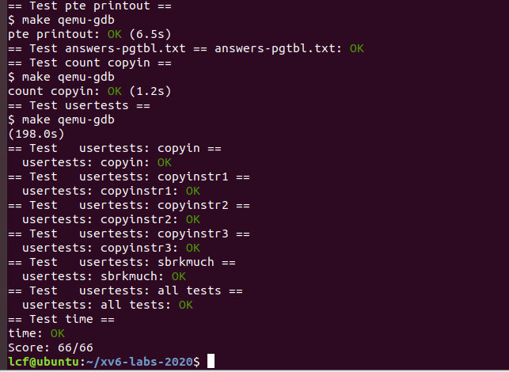

## lab3 page tables
### print a page table
这个实验比较简单，主要操作就是在每个exec中执行一次输出pagetable  
这里参考了freewalk函数的递归写法
```c
// Recursively free page-table pages.
// All leaf mappings must already have been removed.
void
freewalk(pagetable_t pagetable)
{
  // there are 2^9 = 512 PTEs in a page table.
  for(int i = 0; i < 512; i++){
    pte_t pte = pagetable[i];
    if((pte & PTE_V) && (pte & (PTE_R|PTE_W|PTE_X)) == 0){
      // this PTE points to a lower-level page table.
      uint64 child = PTE2PA(pte);
      freewalk((pagetable_t)child);
      pagetable[i] = 0;
    } else if(pte & PTE_V){
      panic("freewalk: leaf");
    }
  }
  kfree((void*)pagetable);
}

//注意riscv.h文件中的宏定义
//下面四个标志位用于显示当前PTE的状态，V代表Valid,R代表Read,W代表Write,U代表User
#define PTE_V (1L << 0) // valid
#define PTE_R (1L << 1)
#define PTE_W (1L << 2)
#define PTE_X (1L << 3)
#define PTE_U (1L << 4) // 1 -> user can access

//下面两个宏函数用于PTE条目和物理地址间的转换
//PTE2PA首先去掉后十位标志位，然后左移十二位作为物理地址的高44位
#define PA2PTE(pa) ((((uint64)pa) >> 12) << 10)
#define PTE2PA(pte) (((pte) >> 10) << 12)

//附上我自己的代码
//一些实现细节：depth控制页表层数，_vmprint作为辅助函数实现递归
//Print a page table
void _vmprint(pagetable_t pagetable, int depth){
  for(int i = 0; i < 512; i++){
      pte_t pte = pagetable[i];
      if((pte & PTE_V) && (pte & (PTE_R|PTE_W|PTE_X)) == 0){
        // this PTE points to a lower-level page table.
        uint64 child = PTE2PA(pte);
        //print information of this layer
        printf("..");
        for(int j=depth-1;j>=0;j--) printf(" ..");
        printf("%d: pte %p pa %p\n",i, pte, child);
        _vmprint((pagetable_t)child,depth+1);
      } else if(pte & PTE_V){
        printf("..");
        for(int j=depth-1;j>=0;j--) printf(" ..");
        printf("%d: pte %p pa %p\n",i, pte, PTE2PA(pte));
      }
    }
}

void vmprint(pagetable_t pagetable){
  printf("page table %p\n",pagetable);
  _vmprint(pagetable,0);
}
```


### A kernel page table per process
①
首先在kernel/proc.h中的proc结构体中增加内核页表  
该结构体每个进程都会有一个，用于维护进程信息
```c
// Per-process state
struct proc {
  struct spinlock lock;

  // p->lock must be held when using these:
  enum procstate state;        // Process state
  struct proc *parent;         // Parent process
  void *chan;                  // If non-zero, sleeping on chan
  int killed;                  // If non-zero, have been killed
  int xstate;                  // Exit status to be returned to parent's wait
  int pid;                     // Process ID

  // these are private to the process, so p->lock need not be held.
  uint64 kstack;               // Virtual address of kernel stack
  uint64 sz;                   // Size of process memory (bytes)
  pagetable_t pagetable;       // User page table
  pagetable_t kpt;             // 增加的内核页表
  struct trapframe *trapframe; // data page for trampoline.S
  struct context context;      // swtch() here to run process
  struct file *ofile[NOFILE];  // Open files
  struct inode *cwd;           // Current directory
  char name[16];               // Process name (debugging)
};
```
②
为实现每个进程都有一个内核页表的功能，这里需要添加一个生成内核页表的函数  
位于kernel/vm.c中
```c
//仿照kvminit书写
pagetable_t
kernelpagetableinit(){
  pagetable_t kpt = uvmcreate();
  if (kpt == 0) return 0;
  uvmmap(kpt, UART0, UART0, PGSIZE, PTE_R | PTE_W);
  uvmmap(kpt, VIRTIO0, VIRTIO0, PGSIZE, PTE_R | PTE_W);
  uvmmap(kpt, CLINT, CLINT, 0x10000, PTE_R | PTE_W);
  uvmmap(kpt, PLIC, PLIC, 0x400000, PTE_R | PTE_W);
  uvmmap(kpt, KERNBASE, KERNBASE, (uint64)etext-KERNBASE, PTE_R | PTE_X);
  uvmmap(kpt, (uint64)etext, (uint64)etext, PHYSTOP-(uint64)etext, PTE_R | PTE_W);
  uvmmap(kpt, TRAMPOLINE, (uint64)trampoline, PGSIZE, PTE_R | PTE_X);
  return kpt;
}
//同理，仿照kvmmap函数编写uvmmap
// add a mapping to the kernel page table.
// only used when booting.
// does not flush TLB or enable paging.
void
kvmmap(uint64 va, uint64 pa, uint64 sz, int perm)
{
  if(mappages(kernel_pagetable, va, sz, pa, perm) != 0)
    panic("kvmmap");
}

// kernelpagetableinit的辅助函数，用于将信息映射到每个进程的内核页表
void
uvmmap(pagetable_t pagetable, uint64 va, uint64 pa, uint64 sz, int perm)
{
  if(mappages(pagetable, va, sz, pa, perm) != 0)
    panic("uvmmap");
}
```
③
写好需要使用的函数后，这里转到proc.c中修改allocproc函数  
allocproc是用于创建进程并执行相关初始化的函数，所以为给每个进程分配一个内核页表，我们需要在这里增加内核页表的初始化和分配（调用上述kernelpagetableinit函数实现）
```c
  // An empty user page table.
  p->pagetable = proc_pagetable(p);
  if(p->pagetable == 0){
    freeproc(p);
    release(&p->lock);
    return 0;
  }
  //在上面的用户页表分配之后仿照上述形式写出内核页表分配
  // Init the kernal page table
  p->kpt = kernelpagetableinit();
  if(p->kpt == 0){
    freeproc(p);
    release(&p->lock);
    return 0;
  }

```
④
确保每一个进程的内核页表都关于该进程的内核栈有一个映射  
内核栈在procinit函数（proc.c）中
```c
// 下面是原进程栈的分配
// Allocate a page for the process's kernel stack.
// Map it high in memory, followed by an invalid
// guard page.
char *pa = kalloc();
if(pa == 0)
  panic("kalloc");
uint64 va = KSTACK((int) (p - proc));
kvmmap(va, (uint64)pa, PGSIZE, PTE_R | PTE_W);
p->kstack = va;

//将其后三行关于栈的映射迁移到allocproc中的内核页分配后面
//注意将kvmmap修改为uvmmap，因为是映射到p->kpt中的
uvmmap(p->kpt, KSTACK((int) (p - proc)), kvmpa(KSTACK((int) (p - proc))), PGSIZE, PTE_R | PTE_W); // 添加映射到kernel pagetable
p->kstack = KSTACK((int) (p - proc)); //添加va-virtual adress
```
⑤
修改scheduler函数（proc.c）以加载进程的内核页到satp寄存器中  
参见注释可知，scheduler函数保持循环，一旦有cpu处于空闲状态即进行进程调度  
```c
//将进程页表加载到satp的方法在vm.c中
// Switch h/w page table register to the kernel's page table,
// and enable paging.
void
kvminithart()
{
  w_satp(MAKE_SATP(kernel_pagetable));
  sfence_vma();
}

//仿照上述函数，写一个将我们定义的内核页表加载入satp寄存器中的函数
// Store kernel page table to SATP register
void
procinithart(pagetable_t kpt){
  w_satp(MAKE_SATP(kpt));
  sfence_vma();
}

//在schedule()中调用该函数
p->state = RUNNING;
c->proc = p;

// Store the kernal page table into the SATP
procinithart(p->kpt);

swtch(&c->context, &p->context);

// Come back to the global kernel page table
// 注意这里切换回原页表
kvminithart();
```
⑥
修改freeproc函数，使得我们定义的内核页表可正常被释放  
这里需要释放kstack和kernelpagetable两个量，但查阅到的资料发生了不一致的地方，先暂且搁置  
```c
//kstack的释放，调用uvmunmap函数
// free the kernel stack in the RAM
uvmunmap(p->kpt, p->kstack, 1, 1);

//内核页表的释放，需要自定义相关函数并在freeproc中调用
if (p->kpt)
  procfreekernelpagetable(p->kpt);
p->kpt=0;

//可参考freewalk函数实现
void
procfreekernelpagetable(pagetable_t kernelpagetable)
{
  // similar to the freewalk method
  // there are 2^9 = 512 PTEs in a page table.
  for(int i = 0; i < 512; i++){
    pte_t pte = kernelpagetable[i];
    if(pte & PTE_V){
      kernelpagetable[i] = 0;
      if ((pte & (PTE_R|PTE_W|PTE_X)) == 0){
        uint64 child = PTE2PA(pte);
        procfreekernelpagetable((pagetable_t)child);
      }
    }
  }
  kfree((void*)kernelpagetable);
}
```
⑦
最后修改vm.c中的kvmpa函数，该函数用于将虚拟地址转换为物理地址。  
为使得进程使用我们定义的内核页表，将其中的原版内核页表替换  
```c
//pte = walk(kernel_pagetable, va, 0);
pte = walk(myproc()->kpt, va, 0);
```

### Simplify copyin/copyinstr
(原来参考的资料显然是出了问题，按照其思路完成的工作总是陷入kerneltrap，所以又找了另一份资料 https://github.com/PKUFlyingPig/MIT6.S081-2020fall/tree/pgtbl的实现 这份工作是优秀且可实现的)
①
首先将进程的页表复制一份到内核页表，编写一个kvmmapuser函数
注：用户的虚拟地址范围不应与内核自身指令和数据的虚拟范围相同，因此需要限制用户虚拟地址的上限为内核地址的下限
```c
// copy PTEs from the user page table into this proc's kernel page table
//这个函数的int pid参数似乎没有用到
void
kvmmapuser(int pid, pagetable_t kpagetable, pagetable_t upagetable, uint64 newsz, uint64 oldsz)
{
  uint64 va;
  pte_t *upte;
  pte_t *kpte;

  //用于限制内存大小
  if(newsz >= PLIC)
    panic("kvmmapuser: newsz too large");

  for (va = oldsz; va < newsz; va += PGSIZE) {
    //walk函数通过页表将虚拟地址转化为PTE
    //第三个参数alloc为1时分配一个页面
    upte = walk(upagetable, va, 0);
    kpte = walk(kpagetable, va, 1);
    *kpte = *upte;
    // because the user mapping in kernel page table is only used for copyin 
    // so the kernel don't need to have the W,X,U bit turned on
    *kpte &= ~(PTE_U|PTE_W|PTE_X);
  }
}
```
②
```c
//在exec.c中，修改exec函数，在其末尾将用户页表复制到内核页表中
kvmmapuser(p->pid, p->kpagetable, p->pagetable, p->sz, 0);
//在proc.c中修改fork函数，增加同样的映射
kvmmapuser(np->pid, np->kpagetable, np->pagetable, np->sz, 0);
//在sysproc.c中修改growproc
// Grow or shrink user memory by n bytes.
// Return 0 on success, -1 on failure.
int
growproc(int n)
{
  uint sz;
  struct proc *p = myproc();

  sz = p->sz;
  if(n > 0){
    if((sz = uvmalloc(p->pagetable, sz, sz + n)) == 0) {
      return -1;
    }
  } else if(n < 0){
    sz = uvmdealloc(p->pagetable, sz, sz + n);
  }
  // =========== solution for pgtbl ---- part 3 =============
  kvmmapuser(p->pid, p->kpagetable, p->pagetable, sz, p->sz);
  // ========================================================
  p->sz = sz;
  return 0;
}
```
③
最后替换掉copyin和copyinstr即可

## 总结
这一节的lab做的还是很困难的，而且由于参考资料的问题，有一段时间一直被bug卡住  
总体而言，本次实验在于用户页表和内核页表的操作，仿照用户页表的相关内容为每个进程新生成一个内核页表并进行相关操作。这个实验做的还不够扎实，如果有机会再回来看这个工程的话，还是要好好梳理一下。  
最后，附上通过截图
